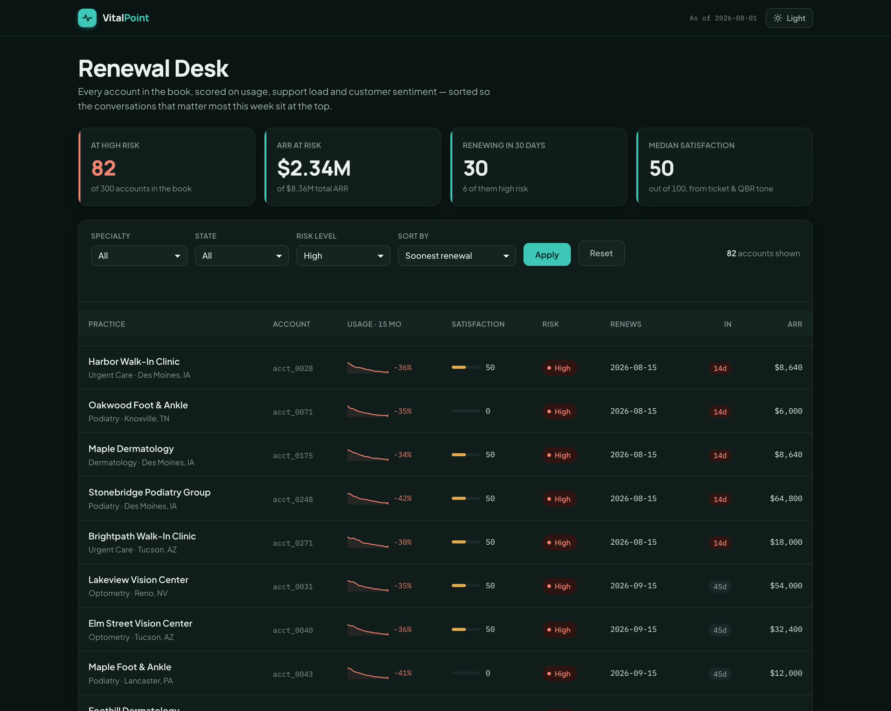
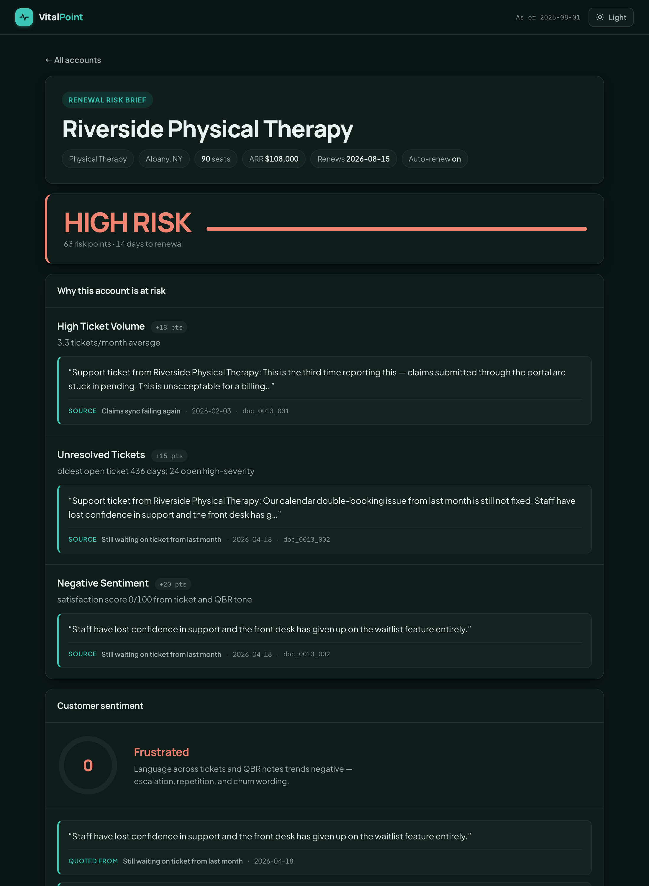
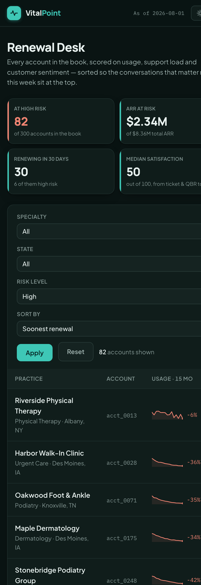

# VitalPoint — Renewal Risk Brief

**One-page, fully-cited renewal risk briefs for a book of 300 SMB medical
practices — with tenant isolation enforced in code and gated in CI.**

[](https://github.com/owlstormai/vitalpoint/actions/workflows/ci.yml)
[](LICENSE)

## The problem this solves

A customer success manager carrying 300 accounts opens Monday morning with one
question: **who do I call today, and what do I say?** The answer is scattered
across support tickets, quarterly business review (QBR) notes, contract terms,
and usage exports — thousands of documents nobody has time to read.

The tempting fix is to let a language model summarize it all. The responsible
fix is a system that **only says what it can prove from the customer's own
documents, cites the exact passage and date behind every claim, and states
plainly when it has no evidence at all.**

> In a multi-tenant book of business, "the model mentioned something from a
> different customer's file" is not a UX bug. It's a compliance incident.

VitalPoint is a fictional practice-management software vendor. The 300
accounts, their contracts, tickets, QBR notes and usage history are entirely
synthetic — generated by a seeded script so the whole system is reproducible,
runs offline, and can be tested against known-correct answers.

## What it looks like

**The renewal desk** — the whole book scored and ranked, filtered here to
high-risk accounts by soonest renewal:



**A brief** — every risk driver sits directly above the quoted evidence, with
the source document, date, and document ID:



One responsive application, not a separate mobile build:



## What it does, end to end

1. **Generate** — a seeded script builds 300 accounts across ten specialties
   and twenty US metros from twelve hand-authored behavioral archetypes
   (`healthy_quiet`, `support_burned`, `champion_left`, `billing_dispute`…).
   Each archetype plants known ground truth: the true risk level, the true
   satisfaction, and which document holds the evidence.
2. **Ingest** — narrative documents are chunked to ≤150 words, each chunk
   tagged with its `account_id`, document type, and date.
3. **Retrieve** — hybrid BM25 + TF-IDF retrieval with reciprocal-rank fusion,
   **scoped to a single account by construction** (see below).
4. **Score** — a transparent weighted rubric turns usage trend, ticket load,
   unresolved-ticket age, seat utilization and sentiment into Low/Medium/High.
   Every contributing signal shows its number and its source.
5. **Write** — a one-page brief where each claim carries a citation, plus a
   **"What we don't know"** section listing the signals with no supporting
   evidence.
6. **Verify** — an eval harness scores the whole pipeline against the planted
   ground truth and fails CI if any gate slips.

## Why tenant isolation is the point

The retrieval layer is built so a cross-tenant leak isn't a rare failure mode
that needs *detecting* — it's a mode that isn't reachable. `HybridIndex`
exposes no unscoped search API at all: the only way to retrieve anything is
`index.for_account(id).retrieve(query)`, and that call builds its BM25/TF-IDF
structures from *only that account's chunks*. Another tenant's text is never
loaded into the scope's scoring structures in the first place, which is a
stronger guarantee than filtering ranked results after the fact — there is no
ranked result to filter, because the other tenant's documents were never
indexed alongside this one's.

To make that guarantee checkable rather than asserted, every account gets a
unique **canary phrase** planted in its contract and nowhere else. The eval
harness queries every other account's scope with every account's canary and
counts leaks; the gate is zero tolerance — not "95% isolated," but exactly 0,
every run, or CI fails.

A leak count of zero would be meaningless if retrieval simply returned nothing,
so a **positive control** runs alongside it: every canary must be findable
inside its *own* scope. Both gates have to hold.

## Quickstart (no API keys required)

```bash
uv venv --python 3.12 && uv pip install -e ".[dev]"
```

```bash
.venv/bin/rrb make-data                 # build the 300-account dataset
```

```bash
.venv/bin/rrb brief acct_0013           # one brief, to the terminal
```

```bash
.venv/bin/rrb serve                     # dashboard at http://127.0.0.1:8078
```

```bash
.venv/bin/python -m evals.run_evals     # the CI gates
```

Runs fully offline by default: a deterministic extractive writer, a lexicon
sentiment scorer, and TF-IDF embeddings mean tests, CI, and the demo need zero
keys and zero network.

## Architecture

```
scripts/make_dataset.py  (or `rrb make-data`)
        │  seeded RNG + hand-authored archetypes (src/rrb/archetypes.py)
        ▼
  data/rrb.sqlite ─────────────────────────────┐
  accounts, usage_metrics, tickets, documents   │  data/golden/labels.yaml
  (system of record)                            │  (planted ground truth:
        │                                       │   risk, satisfaction,
        ▼                                       │   drivers, canaries,
  chunker.py  (paragraph chunks ≤150 words,     │   withheld evidence)
  per-chunk account_id / doc_type / doc_date)   │
        │                                       │
        ▼                                       │
  index.py — HybridIndex                        │
  (chunks grouped by account_id;                │
   for_account(id) → AccountScope built from    │
   that account's chunks ONLY — no unscoped     │
   search API exists)                           │
        │                                       │
        ├───────────────┬────────────────────┐  │
        ▼               ▼                    ▼  │
  signals.py       sentiment.py    for_account(id).retrieve()
  (usage trend,    (lexicon         → cited evidence chunks,
   ticket age,      satisfaction      each with matched_terms
   seat util,       + verbatim        for a relevance floor)
   days to          quotes)                  │
   renewal)             │                    │
        └───────┬───────┘────────────────────┘
                ▼
        scoring.py — score_risk()
        (weighted rubric: signals + sentiment
         + narrative drivers → level, points,
         itemized drivers)
                │
                ▼
        brief.py — build_brief()
        (structured Brief: risk, drivers paired with
         their evidence, sentiment quotes, signals,
         unknowns, markdown)
                │
   ┌────────────┼──────────────┬──────────────────┐
   ▼            ▼              ▼                  ▼
 cli.py     web.py +       export.py          llm.py
 `rrb       templates.py   `rrb export`       maybe_rewrite()
  brief`    `rrb serve`    → JSON for CRM     (optional Claude
            dashboard +      delivery          prose upgrade,
            brief pages                        same citations)
                │
                ▼
        api/index.py — module-level ASGI `app`
        (Vercel entrypoint; read-only SQLite)

                     ▲
                     │ scores the whole pipeline against
                     │ data/golden/labels.yaml
        evals/run_evals.py   (CI-gated; see table below)
```

### Module responsibilities

| Module | Responsibility |
|---|---|
| `archetypes.py` | Hand-authored behavioral archetypes — the narrative source material and planted ground truth |
| `generator.py` | Seeded, deterministic dataset generation; canaries and withheld evidence |
| `db.py` | SQLite schema and connections (foreign keys enforced) |
| `chunker.py` | Paragraph chunking with per-chunk tenant metadata |
| `index.py` | Scope-only hybrid retrieval — the tenant isolation boundary |
| `signals.py` | Deterministic numeric signals from structured data |
| `sentiment.py` | Lexicon satisfaction scoring with verbatim cited quotes |
| `scoring.py` | The transparent weighted risk rubric |
| `brief.py` | Brief assembly, citation relevance floor, abstention |
| `export.py` | JSON serialization for downstream systems |
| `web.py` / `templates.py` | FastAPI routes / all presentation markup |
| `llm.py` | Optional Claude rewrite behind a citation-preserving contract |

## Architecture software

| Layer | Software | Why this one |
|---|---|---|
| Language | **Python 3.12** | Standard library carries most of the weight here — `sqlite3`, `re`, `math`, `dataclasses` |
| Web framework | **FastAPI** on **Uvicorn** | ASGI app that deploys as a single serverless function without modification |
| Storage | **SQLite** (stdlib `sqlite3`) | The system of record. One file, zero operational surface, opened read-only in production |
| Retrieval | **Hand-written BM25 + TF-IDF**, fused with reciprocal-rank fusion | See below — the ML libraries were removed on purpose |
| Presentation | **Server-rendered HTML + CSS custom properties**, no JS framework | ~40 lines of vanilla JS for the theme toggle; nothing to build, bundle, or hydrate |
| Config & labels | **PyYAML** | Golden ground-truth labels |
| Tests | **pytest** | 58 tests, no network, no API keys |
| CI | **GitHub Actions** | Installs clean, rebuilds the dataset, runs the eval gates on every push |
| Hosting | **Vercel** Python runtime | One Vercel Function; the dataset ships with it |
| Optional LLM | **Anthropic Claude** (`claude-sonnet-5`) | Prose rewrite only, behind a citation-preserving contract |

### On dependency weight

The dense retrieval leg originally used scikit-learn's `TfidfVectorizer`. That
pulled in scikit-learn, scipy and numpy — **about 140 MB** — to vectorize, at
most, **eight short documents per account**, because retrieval is scoped to a
single tenant and each account holds only 3–8 chunks.

That is not a trade worth making, so TF-IDF is now ~20 lines of Python
reproducing scikit-learn's defaults exactly: smooth IDF, raw term counts,
L2-normalized vectors, and cosine similarity as a sparse dict product. The
results held up — retrieval MRR went *up* slightly (0.732 → 0.756) and every
eval gate still passes — while the install dropped from ~160 MB to **19 MB**
and the test suite got about 3× faster. BM25 was already hand-written, so the
whole retrieval stack is now dependency-free and readable end to end.

## Deployment

The app deploys to Vercel as a single Python function, with no build step:

- `api/index.py` exports a module-level `app`, and `pyproject.toml` points at
  it explicitly via `[tool.vercel] entrypoint = "api.index:app"`.
- `data/rrb.sqlite` is **committed to the repository**. The demo is a fixed,
  deterministic snapshot, so shipping the 1.3 MB file beats regenerating it on
  every cold start.
- SQLite is opened **read-only** (`mode=ro`), because a serverless filesystem
  is read-only and a normal open can fail when SQLite tries to place a journal
  beside the database file.
- Retrieval structures are built once per cold start and cached; per-account
  scopes are built lazily on first access.

For local development, `rrb serve` runs the same app read-write against a
dataset you generate yourself.

## Delivering briefs to a CRM

A brief that lives only in a dashboard makes the account team come to it. The
work actually happens in the CRM, so every brief serializes to a structured
payload built for that hand-off:

```bash
.venv/bin/rrb export acct_0013                      # one brief as JSON
```

```bash
.venv/bin/rrb export --all --out runs/briefs.json   # the whole book
```

The payload carries the account identifiers, the risk level and points, each
driver **with the citation that evidences it**, the satisfaction score and its
quotes, the raw signals, and the list of unknowns. Citations travel with every
claim deliberately: a risk score in a CRM field is only actionable if the rep
can see the ticket or QBR line it came from.

```jsonc
{
  "account": { "id": "acct_0013", "name": "Riverside Physical Therapy",
               "arr": 108000, "contract_end": "2026-08-15", "auto_renew": true },
  "risk": { "level": "high", "points": 63,
            "drivers": [ { "key": "high_ticket_volume", "points": 18,
                           "detail": "3.3 tickets/month average",
                           "evidence": { "doc_id": "doc_0013_001",
                                         "title": "Claims sync failing again",
                                         "doc_date": "2026-02-03",
                                         "excerpt": "…third time reporting this…" } } ] },
  "satisfaction": { "score": 0, "label": "frustrated", "quotes": [ /* … */ ] },
  "unknowns": []
}
```

That shape maps onto the systems an account team already lives in:

| Target | Natural mapping |
|---|---|
| **Salesforce** | Risk level and score onto custom fields on Account or Opportunity; drivers and citations as a related list or Chatter post; delivered via the REST API, or Bulk API 2.0 for the nightly full-book run |
| **SAP** | S/4HANA or Sales Cloud via OData services, keyed on the business partner / customer master record |
| **Microsoft Dynamics 365** | Web API upsert onto the Account entity, with drivers as annotations |
| **HubSpot** | Company properties plus a timeline event per driver |
| **Customer success platforms** (Gainsight, Totango, ChurnZero, Planhat) | The score becomes a health-score input; drivers become risk reasons or CTAs |
| **Service desks** (Zendesk, ServiceNow, Jira Service Management) | An automatically opened save-play task on high-risk accounts nearing renewal |
| **Warehouses** (Snowflake, BigQuery, Databricks) | Append-only brief history, so risk trend over time becomes queryable |
| **Notification** (Slack, Microsoft Teams, email) | The Monday-morning digest of accounts that changed risk level this week |

**Status:** the JSON contract and the `rrb export` command are implemented and
covered by tests. The per-system adapters and authentication are deliberately
not built — they are integration plumbing specific to a customer's tenant, and
stubbing them would add credential handling without demonstrating anything the
pipeline doesn't already show.

## Evals

`python -m evals.run_evals` scores the pipeline against the planted ground
truth in `data/golden/labels.yaml` and exits non-zero if any gate fails — the
same command CI runs after every `rrb make-data`.

| Eval | What it measures | Gate |
|---|---|---|
| Tenant isolation | Every account's canary queried against every *other* account's scope | `== 0` leaks (zero tolerance) |
| Isolation positive control | Each canary *is* findable in its own scope, so zero leaks can't pass vacuously | `== 0` failures (zero tolerance) |
| Risk accuracy | `build_brief()`'s computed risk level vs. the archetype's planted label | `>= 0.75` |
| Satisfaction accuracy | Computed sentiment label vs. the planted label | `>= 0.75` |
| Citation faithfulness | Every cited excerpt appears verbatim in its source document | `== 1.0` |
| Retrieval recall@5 | Planted evidence document retrieved in the top 5 for its driver query | `>= 0.75` |
| Retrieval MRR | Mean reciprocal rank of that evidence — accounts hold only 3–8 chunks, so recall@5 comes cheap and MRR is what actually grades ranking | `>= 0.7` |
| Abstention honesty | Accounts with withheld QBR notes are correctly flagged under "What we don't know" | `>= 0.9` |

## Optional: Claude prose upgrade

Everything above runs with no API key. Set `ANTHROPIC_API_KEY` and the brief
writer upgrades from extractive assembly to Claude-written prose — under a
strict contract: every claim keeps its citation, no new facts, headings and
quotes preserved. If the rewrite fails or is truncated, the citation-faithful
draft is kept rather than aborting a batch run.

## Testing

```bash
.venv/bin/python -m pytest tests/ -q
```

58 tests cover generator determinism (same seed → identical dataset), the
scoring rubric, the scoped retriever (unscoped access is impossible by
construction), sentiment, brief assembly, the JSON export contract, the CLI,
and the web routes. CI runs the suite, rebuilds the 300-account dataset, and
runs the eval gates on every push.

## License

MIT — see [LICENSE](LICENSE).
